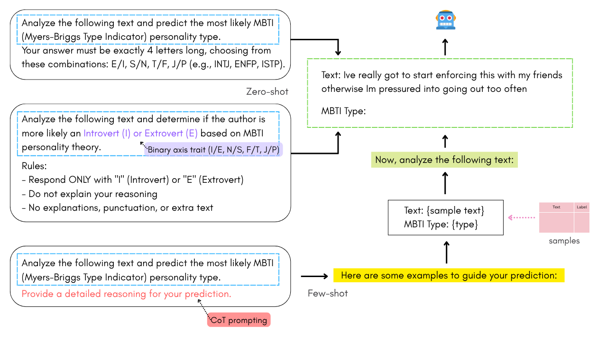
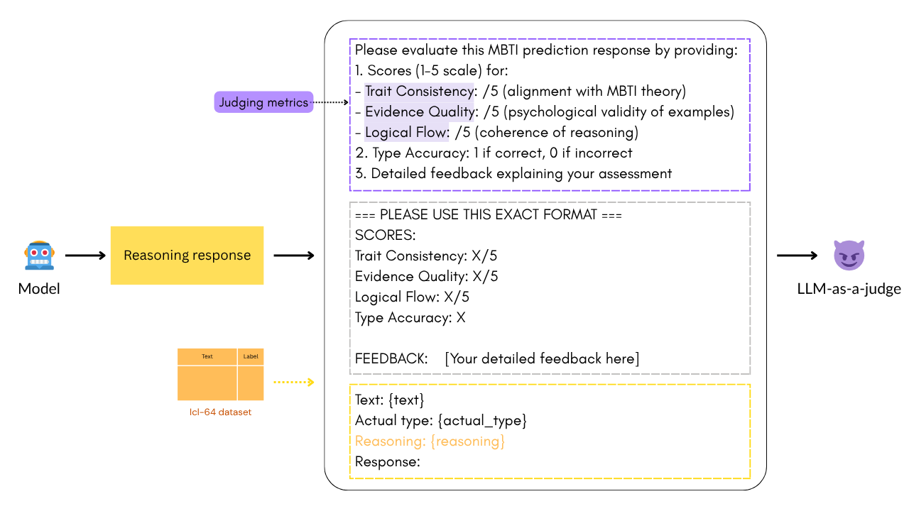
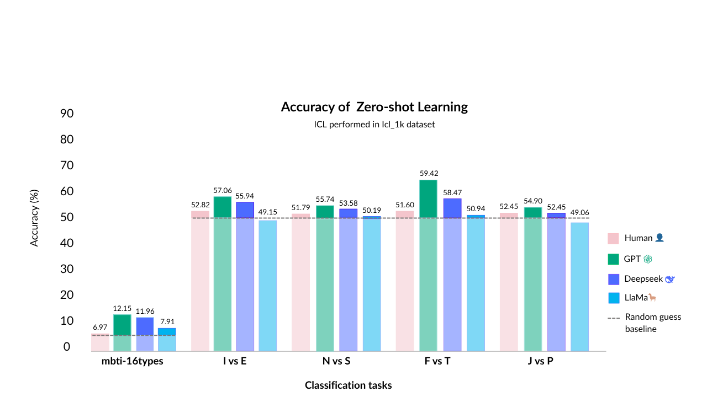

# A Natural Language processing Approach for Personality Profiling using Fine-tuning and In-context Learning

## 📘Background and Motivation
Personality reflects consistent patterns in behavior, emotion, and thought, traditionally measured through self-report tools like the Myers-Briggs Type Indicator (MBTI). However, language—both spoken and written—also reveals personality traits and may capture aspects overlooked by questionnaires. As language reflects internal thought and is less prone to self-report bias, it offers a promising alternative for personality assessment. With recent advances in Natural Language Processing (NLP), this study explores MBTI prediction from user-generated text using two approaches: 

1. **Fine-tuning** encoder-based models (e.g., BERT)
2. **In-Context Learning (ICL)** with decoder-based models (e.g., LlaMa, GPT, Deepseek) with and without Chain-of-Thought (CoT) prompting

---

## 🛠️Methodology

### 1. Datasets
The datasets are extracted from three social media platforms ([Personality Cafe forum](https://www.kaggle.com/datasets/datasnaek/mbti-type), [Reddit](https://zenodo.org/records/1323873), and [Twitter](https://www.kaggle.com/datasets/sanketrai/twitter-mbti-dataset)) containing text and labels (MBTI types). The preprocessing steps involved are filtering only English language texts, removing samples with abusive and harassment contents, and removing special characters and emojis. In this experiment, the dataset is divided into three groups:
1. **Ft-35k**: Normally distributed dataset with 35,554 text and label pairs and maximum 32 words in each text. This dataset will be used for Fine-tuning approach using BERT-base model.
2. **Icl-200**: 200 Text and label pairs dataset with maximum 64 words in each text. This model will be used for In-Context Learning (ICL) with zero-shot inference utilizing GPT-4o model.
3. **Icl-32**: Normally distributed dataset with 32 text and label pairs and 64 words maximum in each text. This dataset will be used for In-Context Learning (ICL) integrating it with Chain-of-Thought (CoT) prompting with zero- and few-shot inference. The number of samples are adjusted to be 16, 32, and 48 samples.

### 2. Model Fine-tuning and In-Context Learning (ICL)

### 3. Prompt Design
1. ICL Zero-shot, Few-shot, and CoT
   
3. LLM-as-a-judge
   

### 4. Evaluation metrics
1. **Quantitative metric**:
   - Accuracy
   - Precision
   - Recall
   - F1-score
3. **Qualitative metric** used to measure the quality of response generated by models using in-context learning.
   - Trait consistency (0-5): Does reasoning align with MBTI theory?
   - Evidence quality (0-5): Are examples psychologically valid?
   - Logical flow (0-5): Is the reasoning chain coherent?

---

## 📊Results

## Fine-tuning

## In-Context Learning

## 📝 Conclusion
